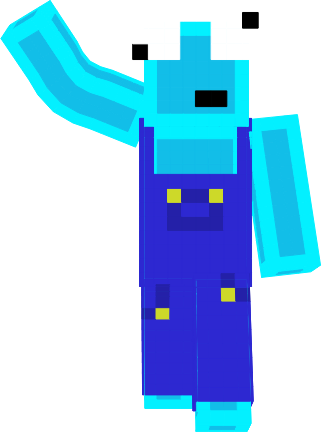

About Me
=============

   Hi I'm Harry, a 21 year old games programmer from the UK

I am a University Student currently studying Computer games programming at Staffordshire University.  
I have been coding Java plugins and mods since February 2023 but I have had a lot of coding experience in C++ and C# before this in College and University.

### Over the past year, I have:
- Made over 100 plugins.
- Worked with multiple content creators and Businesses.
- Established many connections within the Minecraft community.

### Current Clients:

 -   [Sword4000](https://www.youtube.com/sword4000)   
 -   [PhytorMC](https://store.phytormc.com/)
<!---
HarryWhead/HarryWhead is a ✨ special ✨ repository because its `README.md` (this file) appears on your GitHub profile.
You can click the Preview link to take a look at your changes.
--->
